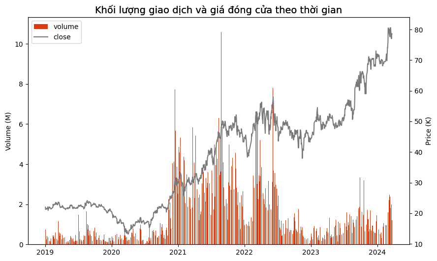
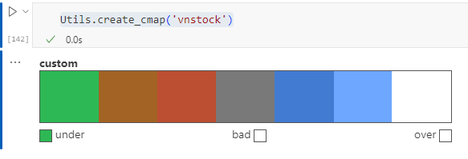

# Giới thiệu

> `vnstock_ezchart` ra đời với một sứ mệnh đơn giản nhưng đầy ý nghĩa: Làm cho việc phân tích dữ liệu trở nên dễ dàng và tiện lợi hơn bao giờ hết đặc biệt là lĩnh vực tài chính/chứng khoán. `vnstock_ezchart` được phát triển như một công cụ bổ trợ cho gói dữ liệu vnstock, nhằm mục đích cung cấp cho cộng đồng một giải pháp toàn diện để biểu diễn và phân tích dữ liệu tài chính một cách dễ dàng, mà không yêu cầu người dùng phải am hiểu sâu về lập trình. Dữ liệu đầu vào của các hàm trong `vnstock_ezchart` nhận kiểu dữ liệu Python phổ biến như List, DataFrame, Series, Numpy array.

Chúng tôi hiểu rằng, để đưa ra những quyết định đầu tư hay nghiên cứu học thuật, việc trực quan hóa dữ liệu là không thể thiếu. Với `vnstock_ezchart` bạn có thể đáp ứng 80% nhu cầu biểu diễn dữ liệu hàng ngày của mình chỉ bằng cách thay đổi các tham số đầu vào của hàm để tùy biến hay đơn giản chỉ cần nạp dữ liệu để xem trước, sau đó quyết định tinh chỉnh để tạo ra biểu đồ đẹp mắt và chia sẻ.

`vnstock_ezchart` sử dụng các thư viện nền bao gồm (nhưng không giới hạn): matplotlib, seaborn, squarify, wordcloud và cung cấp tùy biến thông dụng và tiêu chuẩn hóa chúng để bạn có thể sử dụng dễ dàng thay vì phải học nhiều công sức chỉ để tạo ra các biểu đồ đơn giản trong python.

Khám phá vnstock_ezchart hôm nay, và bắt đầu hành trình đầu tư thông minh của bạn với sự tự tin và hiệu quả tối đa.

# Cài đặt

`pip install git+https://github.com/vnstock-hq/vnstock_ezchart.git@main`

# Sử dụng

Sử dụng demo notebook có trong thư mục docs hoặc link Google Colab dưới đây: 

<a target="_blank" href="https://colab.research.google.com/github/vnstock-hq/vnstock_ezchart/blob/main/docs/vnstock_ezchart_demo.ipynb">
  
</a>

- Khởi tạo client: `ezchart = MPlot()`
- Gọi hàm và biểu diễn dữ liệu: 

```
ezchart.combo_chart(candle_df['volume'] / 1000_000, candle_df['close']/1000,
                  left_ylabel='Volume (M)', right_ylabel='Price (K)',
                  color_palette='vnstock', palette_shuffle=True,
                  show_legend=False,
                  figsize=(10, 6),
                  title='Khối lượng giao dịch và giá đóng cửa theo thời gian',
                  title_fontsize=14
                  )
```


# Các dạng biểu đồ hỗ trợ
- Bar
- Line / Time series
- Combo (Bar + Line)
- Histogram
- Boxplot
- Pie
- Scatter
- Treemap
- Word cloud
- Table
- Pairplot

# Tiện ích

## Xem hướng dẫn tích hợp: 
```
ezchart = MPlot()
MPlot.help('bar)`
```

Kết quả trả về:

```
Vẽ biểu đồ cột với các tùy chỉnh chi tiết.

Tham số:
    - data (pd.DataFrame hoặc pd.Series): Dữ liệu đầu vào dạng DataFrame hoặc Series.
    - title (str): Tiêu đề của biểu đồ.
    - title_fontsize (int): Cỡ chữ cho tiêu đề.
    - xlabel (str): Nhãn cho trục X.
    - ylabel (str): Nhãn cho trục Y.
    - color_palette (str): Tên của bảng màu đã được định trước hoặc danh sách các màu tùy chỉnh. Mặc định là 'vnstock'. Các bảng màu có sẵn: 'percentage', 'amount', 'category', 'trend', 'flatui', 'vnstock', 'learn_anything'. Có thể liệt kê tất cả bảng màu với Utils.brand_palettes.keys().
    - palette_shuffle (bool): Xáo trộn thứ tự màu sắc trong bảng màu, cho phép chọn màu ngẫu nhiên trong bảng màu để biểu diễn cho đến khi bạn ưng ý. Mặc định là False.
    - grid (bool): Hiển thị lưới. Nhận True để hiện thị hoặc False để ẩn lưới.
    - data_labels (bool): Hiển thị nhãn dữ liệu trên biểu đồ.
    - data_label_format (str): Định dạng cho nhãn dữ liệu. Nhận các giá trị rút gọn như 1K, 1M, 1B, 1T tương ứng với 1 ngàn, 1 triệu, 1 tỷ, 1 nghìn tỷ.
    - label_fontsize (int): Cỡ chữ cho nhãn trục X và Y.
    - legend_title (str): Tiêu đề cho chú giải.
    - show_legend (bool): Hiển thị chú giải. Nhận True để hiển thị hoặc False để ẩn chú giải.
    - series_names (list): Danh sách tên cho các dải (series) dữ liệu trong biểu đồ. Nhận giá trị là 1 danh sách (list).
    - font_name (str): Tên của font chữ muốn áp dụng.
    - figsize (tuple): Kích thước của biểu đồ, ví dụ (10, 6).
    - show_xaxis (bool): Hiển thị trục X. Nhận True để hiển thị hoặc False để ẩn trục X.
    - show_yaxis (bool): Hiển thị trục Y. Nhận True để hiển thị hoặc False để ẩn trục Y.
    - tick_labelsize (int): Cỡ chữ cho các nhãn trục.
    - xtick_format (str): Định dạng cho nhãn trục X. Ví dụ định dạng số thập phân '{:.0f}'.
    - ytick_format (str): Định dạng cho nhãn trục Y. Ví dụ định dạng phần trăm '{:.0%}'.
    - tick_rotation (int): Góc quay cho các nhãn trục.
    - xlim (tuple): Giới hạn cho trục X, ví dụ (0, 100).
    - ylim (tuple): Giới hạn cho trục Y, ví dụ (0, 100).
    - background_color (str): Màu nền cho biểu đồ.
    - bar_edge_color (str): Màu viền cho các cột (bar) trong biểu đồ.
```

## Xem bảng màu tích hợp sẵn

```
Utils.create_cmap('vnstock')
```




## Tải font chữ

```
Utils.download_font('Roboto')
```